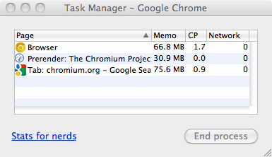

# HTML5 Days 2014
## Möglichkeiten und Fallstricke bei der Performance-Optimierung mit HTML5
-----
# HTML5, Stand heute
-----
## HTML5 Markup
---
### Prefetching

```html
<link rel="next" href="./gallery.html">
<link rel="prefetch" href="./js/image-carousel.js">
<link rel="prefetch" href="./images/picture-1.jpg">
<link rel="prefetch" href="./images/picture-2.jpg">
```

* Die angegebene Ressource wird bei eintretendem Leerlauf vorgeladen
* In der Ressource verlinkte Subressourcen werden nicht beachtet (z.B. in HTML oder CSS)
* Chrome und IE11 machen bis zu 10 Requests parallel, Firefox nur einen
* Ideal zum Vorbereiten der nächsten Seite (Cache-Header nicht vergessen!)

---
### Prefetching

Desktop:

|  |  |  |  |
| ------------- | ------------- | ------------- | ------------- | ------------- |
| &#10004;* | &#10008; | &#10004; | 11+ |

*= Aktuell nur via `--prerender=enabled` Start-Parameter
Soll demnächst offiziell freigeschaltet werden

[Testseite](http://prebrowsing.com/)

---
### Prefetching

Mobile:

|  |  |  |  |  |
| ------------- | ------------- | ------------- | ------------- | ------------- |
| 4+ | &#10008; | &#10008; | 24+ | 11+? (WP8.1) |

[Testseite](http://prebrowsing.com/)

---
### DNS-Prefetching

```html
<link rel="dns-prefetch" href="//ajax.googleapis.com">
```

* Der angegebene Hostname wird so schnell wie möglich per DNS-Abfrage aufgelöst und gecached
* Das spart auf dem Desktop im Schnitt 125 ms. bei der späteren Anfrage einer Ressource von diesem Host
* Auf mobilen Devices spart es deutlich mehr Zeit

Für durchschnittliche DNS-Zeiten, siehe `chrome://histograms/DNS`
 -> Sektion `DNS.PrefetchResolution`
---
### DNS-Prefetching

Gut zum Vorbereiten des Browsers auf externe JavaScript-Libraries:

```html
<head>
	<link rel="dns-prefetch" href="//ajax.googleapis.com">
</head>
<body>
	...blah...blah...
	<script src="//ajax.googleapis.com/ajax/libs/jquery/1.10.2/jquery.min.js">
</body>
```

---
### DNS-Prefetching

Hilfreich bei externen Webfonts, sofern diese erst im Stylesheet referenziert werden:

```html
<head>
	<link rel="stylesheet" href="styles.css">
	<link rel="dns-prefetch" href="//fonts.googleapis.com">
</head>
```

```css
@import url(//fonts.googleapis.com/css?family=Open+Sans);
```

(Noch besser ist es, Webfonts gar nicht via CSS zu importieren)
---
### DNS-Prefetching

Hilfreich bei weiterleitungen:

```html
<link rel="dns-prefetch" href="//mobil.zeit.de">
```

http://www.zeit.de/index -> Weiterleitung -> http://mobil.zeit.de/index

(Noch besser ist es, auf Weiterleitungen zu verzichten)
---
### DNS-Prefetching

Desktop:

|  |  |  |  |
| ------------- | ------------- | ------------- | ------------- | ------------- |
| &#10004; | &#10008; | &#10004; | 11+ |

[Testseite](http://prebrowsing.com/)

---
### DNS-Prefetching

Mobile:

|  |  |  |  |  |
| ------------- | ------------- | ------------- | ------------- | ------------- |
| &#10008; | 29+ | &#10008; | 24+ | 11+? (WP8.1) |

[Testseite](http://prebrowsing.com/)
---
### Subresource

```html
<head>
	<link rel="subresource" href="veryimportant.js">
</head>
<body>
	...blah...blah...
	<script src="veryimportant.js">
</body>
```

* Die angegebene Ressource wird früh beim Preparser registriert
* Der Preparser kann sie vorladen, abhängig von ihrer vermuteten Rolle im "Critical Path"
* Erlaubt den Spagat aus "JavaScript nicht-blockierend im Fuß" + frühes Signalisieren an den Preparser
---
### Subresource

Desktop:

|  |  |  |  |
| ------------- | ------------- | ------------- | ------------- | ------------- |
| &#10004; | &#10008; | &#10008; | 11+ |

---
### Subresource

Mobile:

|  |  |  |  |  |
| ------------- | ------------- | ------------- | ------------- | ------------- |
| &#10008; | &#10004; | &#10008; | &#10008; | 11+? (WP8.1) |
---
### Prerender

```html
<link rel="prerender" href="probable-next-page.html">
```

* Kann in jeder Seite nur einmal verwendet werden
* Öffnet eine unsichtbare Browser-Instanz und rendert die angegebene Seite darin
* Surft der Besucher dann zu dieser Seite weiter, ist sie sofort da
---
### Prerender

Aktives Prerender wird im Chrome Task Manager (Shift + Esc) angezeigt:


---
### Prerender

Folgende Bedingungen müssen erfüllt sein:

* Der Browser hält gerade keine andere Seite via "prerender" vor
* Die Ziel-URL fordert nicht zum Download auf
* Die Ziel-URL erzeugt keine `alerts` oder neue Fenster
* Die Ziel-URL ist nicht passwortgeschützt (HTTP Auth)
* Es befinden sich weder HTML5 Video/Audio noch Flash in der zu rendernden Seite
* Der Browser befindet sich nicht im Inkognito-Modus
* Die Developer Tools sind **nicht** geöffnet
---
### Prerender

Achtung beim Zählen von Seitenaufrufen!

* Am besten nicht per Bild, sondern per JavaScript
* Vor dem Tracken die **Page Visibility API** befragen
* Falls die Seite geprerendert wird, auf einen Sichtbarkeitswechsel horchen:

```js
if (document.visibilityState == 'prerender') {
  document.addEventListener('visibilitychange', handleVisibilityChange, false);
}
```

Wird von Google Analytics & Co schon lange beachtet
---
### Prerender

Achtung bei zeitbasierten JavaScript-Methoden!

* `requestAnimationFrame` statt `setTimeout` oder `setInterval`
* CSS-basierte Animationen statt JavsScript-basierte

Diese Techniken werden in Hintergrund-Tabs pausiert und fressen dann keine Ressourcen.
---
### Prerender

Desktop:

|  |  |  |  |
| ------------- | ------------- | ------------- | ------------- | ------------- |
| &#10004; | &#10008; | &#10008; | 11+ |

---
### Prerender

Mobile:

|  |  |  |  |  |
| ------------- | ------------- | ------------- | ------------- | ------------- |
| &#10008; | &#10008; | &#10008; | &#10008; | 11+? (WP8.1) |

Bei Mobilgeräten gibt es den Interessenskonflikt, dass man gleichzeitig den Datenverbrauch gering halten möchte. Dementsprechend bleibt `prerender` in Chrome abgeschaltet.
---
### Lazyload

```html
<head>
     <link rel="stylesheet" src="styles.css">
     <link rel="stylesheet" src="animations.css" lazyload>
 </head>
 <body>
    
    
    
    
 </body>
```

* Eine mit `lazyload` ausgezeichnete Ressource wird im Ladevorgang hinten angestellt
* Eine mit `lazyload` ausgezeichnete Ressource blockiert nicht mehr das globale `load`-Event
---
### Lazyload

Desktop:

|  |  |  |  |
| ------------- | ------------- | ------------- | ------------- | ------------- |
| &#10008; | &#10008; | &#10008; | 11+ |

---
### Lazyload

Mobile:

|  |  |  |  |  |
| ------------- | ------------- | ------------- | ------------- | ------------- |
| &#10008; | &#10008; | &#10008; | &#10008; | 11+? (WP8.1) |
---
### Postpone

```html

```

Eine mit `postpone` ausgezeichnete Ressource wird erst geladen, sobald sie sichtbar wird:

* Sei es durch explizites Einblenden (z.B. via `display` != `none`) im Sichtbereich
* Oder durch ein in-den-Sichtbereich-Scrollen

Eine mit `postpone` ausgezeichnete Ressource blockiert ebenfalls nicht mehr das globale `load`-Event
---
### Postpone

Desktop:

|  |  |  |  |
| ------------- | ------------- | ------------- | ------------- | ------------- |
| &#10008; | &#10008; | &#10008; | &#10008; |

---
### Postpone

Mobile:

|  |  |  |  |  |
| ------------- | ------------- | ------------- | ------------- | ------------- |
| &#10008; | &#10008; | &#10008; | &#10008; | &#10008; |
---
### Lazyload & Postpone

`lazyload` und `postpone` können an folgende Element-Typen angeheftet werden:

* img
* audio
* video
* script
* link
* embed
* iframe
* object
---
### Lazyload & Postpone

* `lazyload`- und `postpone`-behaftete Elemente blockieren das globale `load`-Event nicht.
* Sind alle mit `lazyload` ausgezeichneten Elemente geladen, wird ein globales `lazyload`-Event gefeuert
* `lazyload`- und `postpone`-behaftete Elemente feuern nach wie vor individuelle, eigene `load`-Events
---
### Async
```html
<script src="independantscript.js" async>
```

Das `async`-Attribut ist eine Erfindung von Mozilla und kann an `script`-Elemente angeheftet werden.

Dieses Script muss dann nicht mehr "in Reihe" ausgeführt werden, sondern kann ausgeführt werden, sobald es heruntergeladen ist.

Normalerweise werden Scripte parallel geladen und Reihe ausgeführt, da untereinander Abhängigkeiten bestehen könnten.
---
### Async

Keine gute Idee:

```html
<script src="jquery.js" async>
<script src="jquery-plugin.js" async>
```

Da `jquery-plugin.js` sehr wahrscheinlich kleiner ist als `jquery.js` wäre es vorher runtergeladen und würde als erstes ausgeführt. Es würde Schiffbruch erleiden.
---
### Async

Besser:

```html
<script src="jquery-und-alle-jquery-plugins.js" async>
<script src="von-jquery-vollkommen-unabhaengiges-script.js" async>
```

Die Chancen für `async` steigen mit dem Grad, in dem wir von jQuery unabhängig werden.
---
### Dynamisch erzeigte Scripte & async

Das Äquivalente Verhalten von Scripten, wenn Sie dynamisch erzeugt werden:

```js
var script = document.createElement('script');
script.src = "file.js";
document.body.appendChild(script);
```
